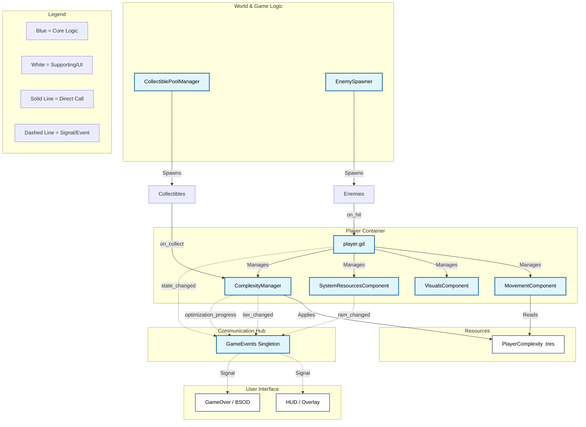
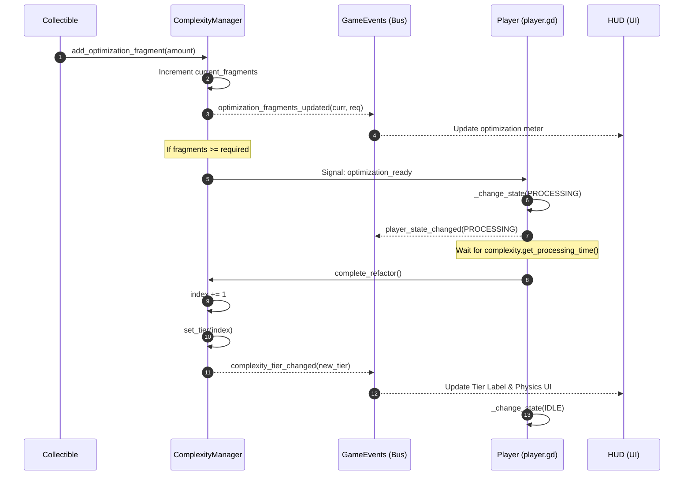
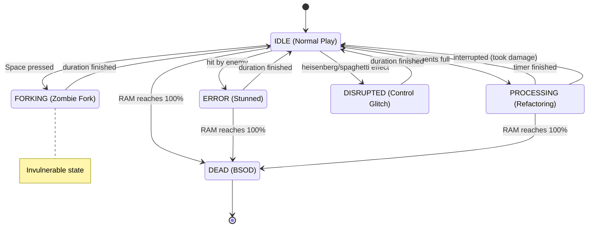

# Architecture Diagrams: Big O: Technical Debt

This document provides visual representations of the system architecture using Mermaid diagrams.

## 1. System Overview (Node & Component Structure)

This diagram shows the relationships between the Player, its components, the Global Event Bus, and major game managers.

---

## 2. Refactor & Optimization Flow

This sequence diagram detail the steps from collecting a packet to successfully upgrading the Big O complexity tier.

---

## 3. Player State Machine

